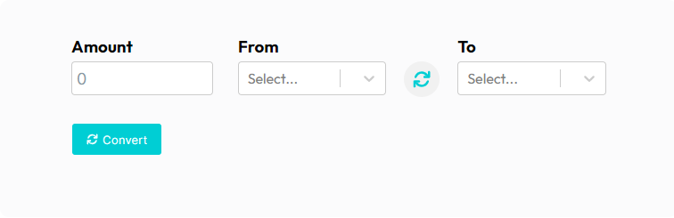
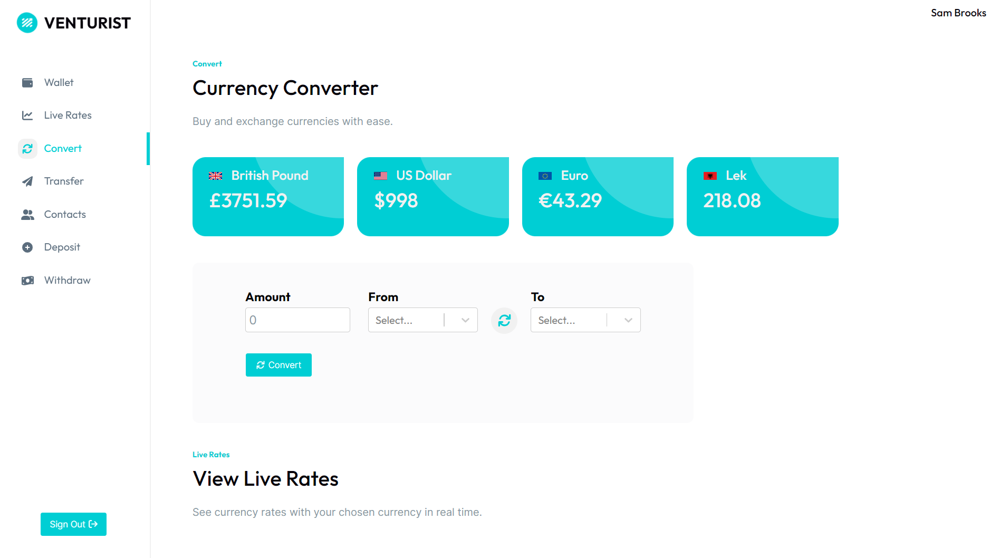
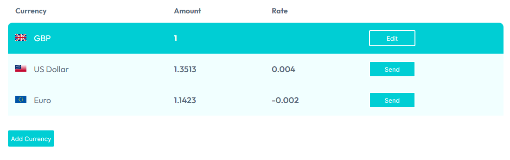

# Venturist Client Project 

## About

A real-life MVP for a development project, delivered as a Scrum team to a client who will use it for future development. It will include a React front-end and Spring back-end integration, including authentication and CI deployment to GCP.

Created a financial app with account and foreign exchange functionalities.

## Specification

- To be able to create an account.
- Receive money from different users.
- Convert money into different currencies and transfer the money to different users.
- Withdraw money from your account.

## Current Features

- Exchange between different currencies.
- Store currencies in wallets.

## Figma Link

The Figma design was used as a base to get started and to have a design pattern for the whole website however there were some design changes on the actual website.

Figma Link - https://www.figma.com/file/Bi35czqJ0j8BFA75MRBycX/Synergy?node-id=0%3A1 

## Icon Copyrights/Credits

All icons currently used from fontawesome; licensing found at: https://fontawesome.com/license

## Font Copyrights/Credits

All fonts used can be found at https://fonts.google.com/  

## Screenshots

